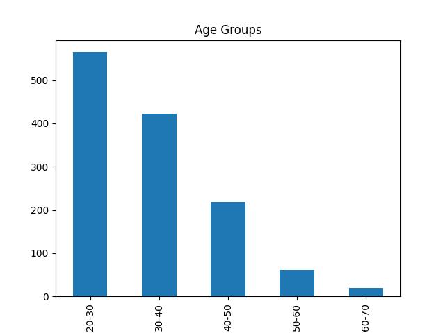
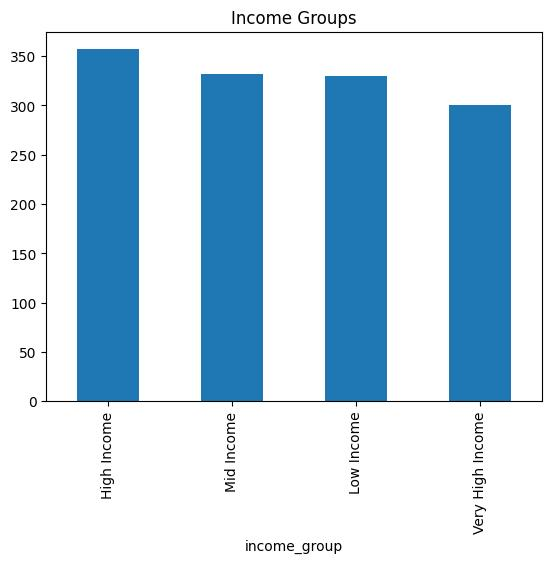
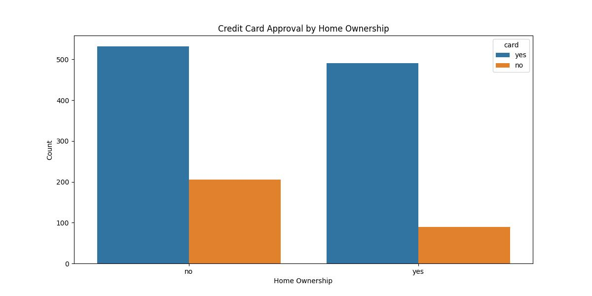
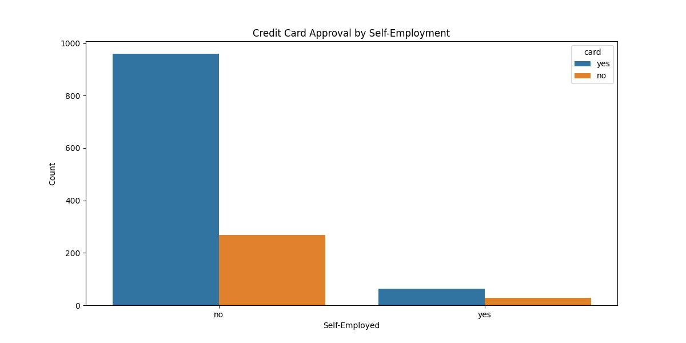
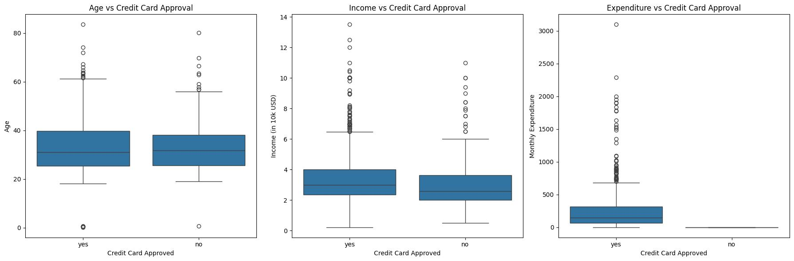
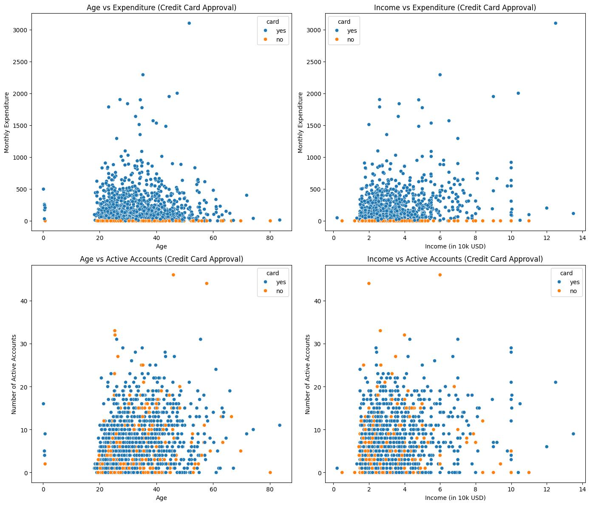
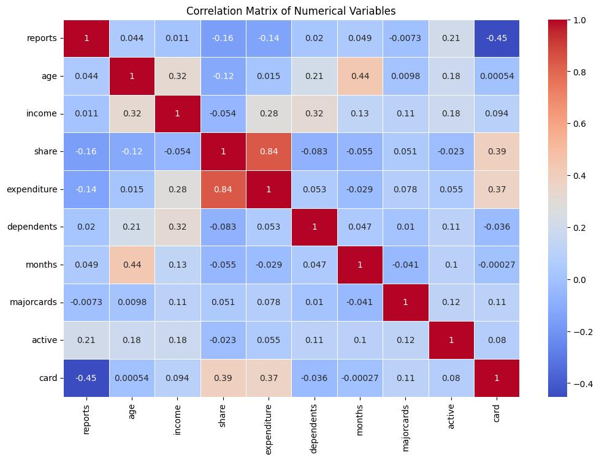
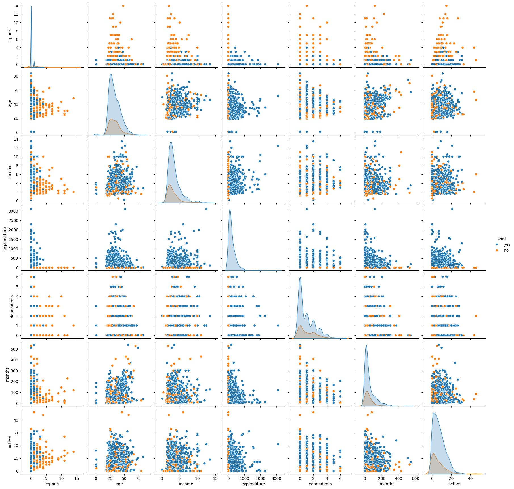
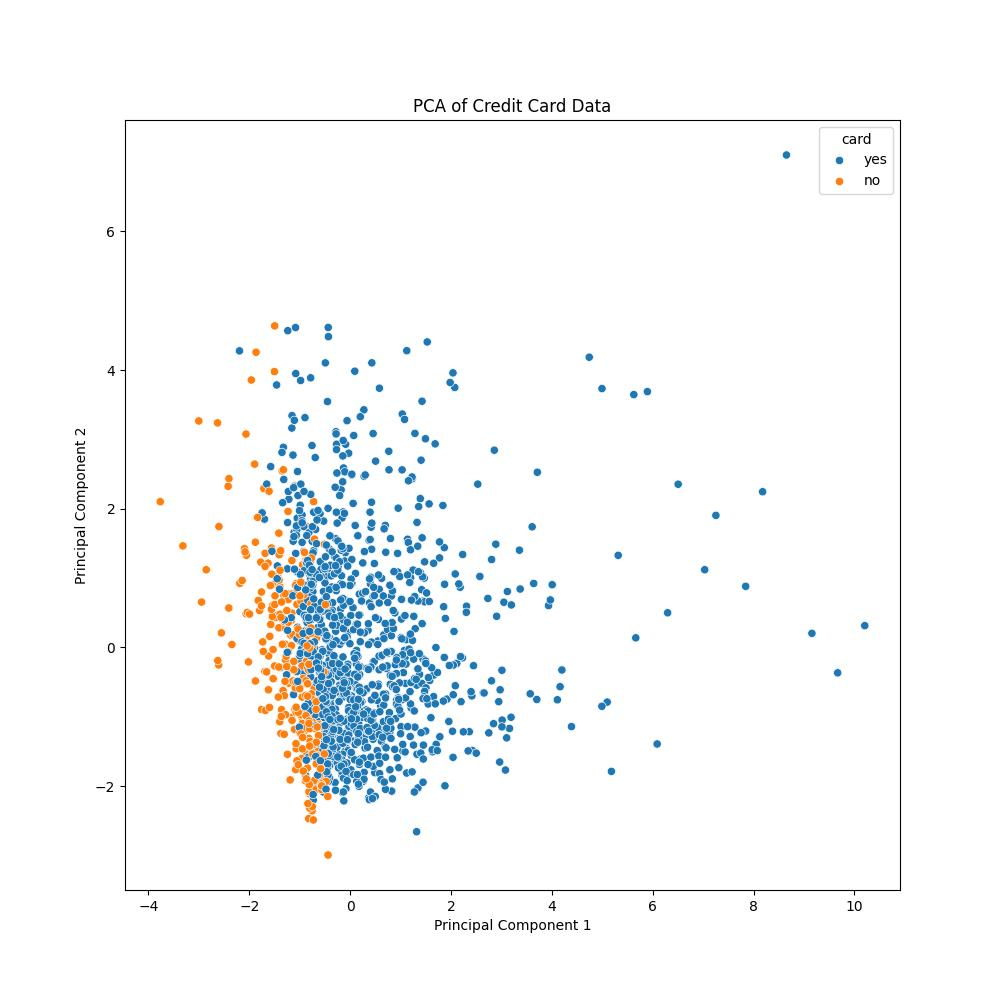
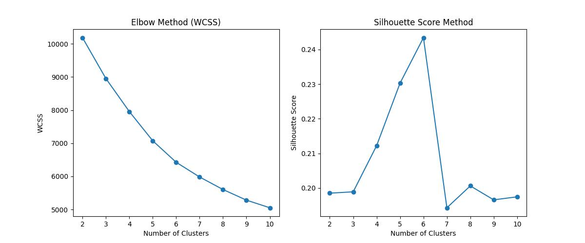

# 🧾 Credit Card Data Analysis – EDA & Predictive Modeling Case Study


> 📁 This repository includes:
> - `Credit_Card_Data_Analysis_Case_Study.ipynb` – Full analysis notebook  
> - `data/CreditCard.csv` – Cleaned dataset  
> - `README.md` – This documentation file
> - `assets/*.jpg` - All visualizations attached in README file

## 🧾 Project Summary

This case study presents an **exploratory data analysis (EDA)** and predictive modeling exercise using customer credit card data from **January 2022 to December 2023**. The goal is to uncover actionable insights on **purchasing behavior**, **spending trends**, and **approval patterns** that can support business decision-making and customer targeting strategies.

## 📚 Table of Contents
1. [Project Summary](#-project-summary)
2. [Key Findings](#-key-findings)
3. [Business Implications](#-business-implications)
4. [Problem Statement](#-problem-statement)
5. [Data Preparation & Variable Overview](#-data-preparation--variable-overview)
6. [Methodology](#-methodology)
7. [Exploratory Data Analysis](#exploratory-data-analysis-eda)
8. [Statistical Testing](#-statistical-testing)
9. [Predictive Modeling](#-predictive-modeling--logistic-regression)
10. [PCA & Dimensionality Reduction](#-dimensionality-reduction--pca-principal-component-analysis)
11. [Clustering](#-cluster-analysis--customer-segmentation-using-k-means)
12. [Actionable Insights](#️-actionable-insights)
13. [How to Reproduce](#-how-to-reproduce)
14. [Author](#-author)

---

## 🔍 Key Findings

- 🎯 **Age Group 25–35 Dominates Spending**  
  This segment contributes the highest number of purchases and is ideal for focused marketing campaigns.

- 🎄 **Seasonality Effect Observed**  
  Spending peaks in December, highlighting the potential of seasonal promotions.

- 👥 **Customer Segments Identified**  
  - **Frequent Buyers**: High-value customers with consistent spending patterns  
  - **Occasional Buyers**: Moderate spenders with sporadic purchases  
  - **Inactive Customers**: Low or no recent activity — a candidate group for re-engagement campaigns

---

## 🎯 Business Implications

The insights from this analysis can help:
- Optimize **customer retention**
- Refine **credit approval strategies**
- Personalize **marketing campaigns**
- Lay the groundwork for **predictive models and segmentation frameworks**

---

## 💼 Problem Statement

To support growth and mitigate risk, this study explores:

1. **Key drivers** influencing credit card approvals  
2. **Customer segmentation** based on financial and behavioral patterns  
3. **Risk detection** by examining approval trends across customer profiles

---

## 🧾 Data Preparation & Variable Overview

### ✅ Data Snapshot

- **Total Records**: 1,319
- **Total Variables**: 12
- **Missing Values**: None (handled with median imputation where needed)
- **Data Types**: Mix of numerical (int, float) and categorical (yes/no)

### 🧾 Variable Descriptions

| Variable     | Description                                                |
|--------------|------------------------------------------------------------|
| `card`       | Was the credit card application approved? (Yes/No)         |
| `reports`    | Number of major derogatory credit reports                  |
| `age`        | Age in years plus twelfths of a year                       |
| `income`     | Annual income (in $10,000s)                                |
| `share`      | Monthly card spend / Annual income                         |
| `expenditure`| Average monthly credit card expenditure                    |
| `owner`      | Does the individual own their home? (Yes/No)               |
| `selfemp`    | Is the individual self-employed? (Yes/No)                  |
| `dependents` | Number of dependents                                       |
| `months`     | Months at current address                                  |
| `majorcards` | Number of major credit cards held                          |
| `active`     | Number of active credit accounts                           |

### 🛠️ Data Cleaning & Preprocessing

- Imported and inspected the dataset using `pandas`  
- Confirmed absence of missing values using `.isnull().sum()`  
- Applied **median imputation** for numeric fields as a precaution  
- Removed duplicate entries (if any)  
- Converted categorical variables (`owner`, `selfemp`) into appropriate formats  
- Ensured correct data types and consistency across all variables


---

## 🧪 Methodology

### 🔧 Data Preparation
- Handled missing values using **median imputation**
- Removed duplicate entries
- Standardized numerical features (`income`, `expenditure`, `share`)
- Encoded categorical variables (`owner`, `selfemp`)
- Detected and treated **outliers** using statistical thresholds

### 🧪 Libraries Used
- `pandas`, `numpy`, `seaborn`, `matplotlib`
- `scipy.stats` for statistical testing
- `scikit-learn` for modeling, clustering, and preprocessing

---

## Exploratory Data Analysis (EDA)

## 📊 Univariate Analysis

### 🎯 Target Variable – Credit Card Approval (`card`)
- Count plots show a class imbalance: a higher number of approved applications compared to rejected ones.

### 📉 Numerical Variables (Histograms & Box Plots)
Explored distribution, skewness, and outliers for:
`reports`, `age`, `income`, `share`, `expenditure`, `dependents`, `months`, `majorcards`, and `active`.

#### Key Observations:
- **Age**: Concentrated between 25–40 years, slight right-skew.
- **Reports**: Mostly 0, but some applicants have very high derogatory reports (extreme right-skew).
- **Income & Expenditure**: Right-skewed with heavy tails — high-income and high-spending outliers exist.
- **Share**: Most people spend conservatively on credit cards, but a few outliers spend disproportionately more.
- **Dependents, Months, Active Accounts**: Skewed toward lower values, but meaningful variance exists.

### 📦 Outlier Detection
- Outliers identified in `reports`, `income`, `share`, and `expenditure`
- Box plots revealed heavy upper tails — these variables may require transformation or robust scaling for modeling.

---

## 📈 Summary Statistics & Distribution Metrics

Summary statistics (mean, median, std, min, max) were calculated for all numerical columns.

### 📐 Skewness & Kurtosis Insights:

| Variable     | Skewness | Kurtosis | Insight |
|--------------|----------|----------|---------|
| `reports`    | +4.88    | 30.56    | Highly skewed; major outliers with bad credit |
| `income`     | +1.93    | 4.93     | Right-skewed; some high-income outliers |
| `share`      | +3.17    | 16.25    | Most spend cautiously; few risky outliers |
| `expenditure`| +3.72    | 22.28    | Some high spenders, possibly risk or VIPs |
| `majorcards` | −1.64    | 0.70     | Negatively skewed; most have 1 card |
| `age`        | +0.84    | 1.47     | Slight skew; mostly young to mid-age applicants |

> 📌 Variables with high skew and kurtosis were flagged for transformation or normalization during modeling.

---

## 📊 Categorical Variables

Bar plots were used for:

- **Home Ownership (`owner`)**: Majority are homeowners — a strong signal for stability.
- **Self-Employment (`selfemp`)**: Most applicants are not self-employed — relevant for credit scoring models.

---

## 📊 Binning Analysis – Age & Income Groups

To extract segment-level insights:

- **Age** was binned into ranges: `20–30`, `30–40`, `40–50`, etc.
- **Income** was grouped into quartiles: `Low`, `Mid`, `High`, `Very High`

### 💡 Key Findings:

- **Age Group 20–30** had the highest number of applicants → key marketing segment
- **Low-income applicants** dominated the pool, but high-income groups had higher approval rates
- **Cross-analysis** of age & income helps refine targeting:
  - Younger high-income = emerging premium customers
  - Older low-income = financially conservative or risk-averse group

> 🎯 These insights help in designing **credit products** suited to life-stage and financial capacity.
### 📸 Age Group Distribution



*Most applicants fall into the 20–30 and 30–40 groups — a key demographic for product targeting.*

### 📸 Income Group Distribution



*Applicants are mostly concentrated in the Low and Mid Income categories — useful for building inclusive financial products.*

---

## 🔁 Bivariate Analysis

This section explores the relationship between predictor variables and the target (`card` – credit card approval), using both categorical and numerical comparisons.

### 📊 Categorical vs Target Variable

#### 🏠 Credit Card Approval by Home Ownership


- Homeowners have a significantly higher approval rate.
- Indicates that **home ownership is a strong positive factor** in approval decisions.

#### 👨‍💼 Credit Card Approval by Self-Employment


- Self-employed individuals have **slightly lower approval rates**.
- Banks may perceive self-employment as a risk factor.

### 📦 Numerical vs Target Variable

#### 📈 Boxplots: Age, Income, and Expenditure vs Credit Card Approval


- **Age**: Older applicants tend to get approved more often.
- **Income**: Approved applicants typically have higher income levels.
- **Expenditure**: Higher spenders are more likely to be approved.

These distributions suggest **clear behavioral differences** between approved and non-approved customers.

### 🔍 Scatter Plots – Multivariate View


- **Age vs Expenditure**: Older individuals spend more and are approved more.
- **Income vs Expenditure**: A strong positive relationship; approvals cluster at higher values.
- **Age/Income vs Active Accounts**: Applicants with more active accounts and higher income/age are more likely to be approved.

> 📌 These plots show that **expenditure and active credit behavior** are key approval drivers.

---

## 📉 Correlation Analysis

A correlation heatmap shows relationships between numerical variables and `card`.



- **Expenditure and Income** show the strongest positive correlation.
- No single variable has a very strong correlation with approval, suggesting approvals are influenced by **multiple interacting features**.

---

## 🧪 Statistical Testing

### 📊 Chi-Square Test (Categorical vs Categorical)
Tested association between `owner` and `card`.

- **Chi-Square Statistic**: 28.11  
- **p-value**: 1.14e-07 ✅ (Significant)

> 🟢 Conclusion: **Homeownership is significantly associated with approval status.**

### 📊 T-test (Numerical vs Categorical)
Compared `income` between approved and not approved groups.

- **T-statistic**: 3.44  
- **p-value**: 0.0006 ✅

> 🟢 Conclusion: **Approved applicants earn significantly more.**

### 📊 Mann-Whitney U Test (Robust Non-parametric Test)

- **U Statistic**: 178320.5  
- **p-value**: 3.09e-06 ✅

> 🟢 Confirms the T-test: **Income distribution differs significantly across approval status.**

---

## 🔀 Multivariate Analysis

This section examines how multiple features interact simultaneously, helping uncover complex patterns not visible in pairwise comparisons.

### 📸 Pairplot – Exploring Pairwise Relationships

A pairplot of the key numerical variables colored by the target variable (card) helps us understand how these features interact.

- **Variables included**: reports, age, income, expenditure, dependents, months, active


- **Pairplot Insights**: Although no single pair of variables shows a clear boundary between approved and non-approved applicants, combinations like income vs expenditure and age vs active accounts provide subtle but valuable trends.

> The plot indicates that multivariate patterns, not just individual variables, contribute to understanding approval decisions.

> 📌 This multivariate exploration justifies the need for models like logistic regression and clustering, which can handle such interactions.

---

### 🤖 Predictive Modeling – Logistic Regression

A Logistic Regression model was trained to predict credit card approval (card) using key customer attributes.

#### 📊 Classification Report

```bash 
Metric	Class "No" (Not Approved)	Class "Yes" (Approved)
Precision	0.91	1.00
Recall	1.00	0.97
F1-Score	0.95	0.98
Support	62	202

Overall Accuracy: 98%
Macro Avg (F1-Score): 0.97
Weighted Avg (F1-Score): 0.98
```

### 📉 Model Evaluation Summary

- **Accuracy**: 98%
- **Precision (Approved)**: 1.00
- **Recall (Approved)**: 0.97
- **F1 Score**: 0.98
- **ROC-AUC**: ~0.99 (if available)

> 📌 The model handles class imbalance well and maintains high generalization.

---

#### ✅ Interpretation:

- The model is very good at predicting approvals and non-approvals.

- Perfect precision for approvals — it doesn’t falsely approve.

- Slight recall drop for approved cases (misses ~3% of actual approvals).

- Class imbalance (more approvals than rejections) is handled well.

#### 🔍 Feature Importance from Logistic Regression

---

#### 📊 Top Influential Features

| Rank | Feature     | Coefficient | Interpretation                                  |
|------|-------------|-------------|--------------------------------------------------|
| 1️⃣   | expenditure | +1.69       | Strongly increases approval chance              |
| 2️⃣   | majorcards  | +0.14       | More cards = more experience = more approval    |
| 3️⃣   | active      | +0.06       | More active accounts = better approval odds     |
| 4️⃣   | age         | +0.04       | Older applicants more likely to be approved     |
| 5️⃣   | share       | ~0.00       | Slight positive influence                        |
| 6️⃣   | months      | -0.0046     | Slight negative influence                        |
| 7️⃣   | income      | -0.02       | Surprisingly weak, slightly negative            |
| 8️⃣   | dependents  | -0.66       | More dependents = less chance of approval       |
| 9️⃣   | reports     | -1.26       | Significantly lowers approval odds              |


---

#### 📌 Key Takeaways

> 🔺 Expenditure is the most influential positive factor — spending behavior matters more than income.

> 🟢 Major credit cards and active accounts suggest experience with credit and increase approval likelihood.

> 🔻 Derogatory reports and many dependents reduce approval chances significantly.

> 💰 Income alone doesn’t ensure approval — banks prefer customers who use credit actively.

> 🎯 The model highlights that behavioral credit usage (spending, experience) is more important than static financial indicators like income.

---

### 📉 Dimensionality Reduction – PCA (Principal Component Analysis)

To understand the underlying structure of the dataset and reduce dimensionality, PCA was performed on all standardized numerical variables.

#### 📊 Explained Variance by Components

| Principal Component | Variance Explained (%) |
|---------------------|------------------------|
| PC1                 | ~23.1%                 |
| PC2                 | ~19.6%                 |
| PC3                 | ~13.2%                 |
| PC4                 | ~11.0%                 |
| PC5                 | ~9.4%                  |
| PC6                 | ~8.2%                  |
| PC7                 | ~6.3%                  |
| PC8                 | ~5.0%                  |
| PC9                 | ~4.2%                  |

> ✅ **First 2 Components Explain ≈ 42.7% of Variance**

---

#### 📸 PCA Visualization (PC1 vs PC2)



---

#### 🔍 Insight

- Some **separation between approval classes** is observed in PC1/PC2 space.
- However, the variance is spread across several components, indicating **credit approval decisions are multidimensional**.
- PCA may assist in **visual exploration**, but may **not fully replace** the original features in predictive modeling.

---

#### 🎯 Interpretation

- PCA helps identify **latent dimensions** in the dataset.
- It reveals that credit approval is influenced by **multiple subtle interactions** between variables.
- Although dimensionality reduction is possible, the **loss of variance beyond PC2** means **careful evaluation** is needed before replacing features.

---

### 🔍 Cluster Analysis – Customer Segmentation using K-Means

To better understand **customer subgroups**, we applied **K-Means Clustering** on standardized numerical features. This segmentation helps identify customer profiles that influence credit approval decisions.

#### ⚙️ Methodology

- Selected 9 key numerical variables:
  `reports`, `age`, `income`, `share`, `expenditure`, `dependents`, `months`, `majorcards`, `active`

- Standardized features using `StandardScaler`

- Used both **Elbow Method** and **Silhouette Scores** to determine the optimal number of clusters

- Final model used **K=6** clusters

#### 📉 Cluster Evaluation



---

#### 📊 Cluster Profiles & Insights

| Cluster | Key Traits | Interpretation |
|--------:|------------|----------------|
| **0** | Middle-aged, higher income, stable residence, low derogatory reports | Prime candidate for approval, reflects responsible financial behavior |
| **1** | Older, moderate income, very high residential stability | Conservative and stable; good credit approval prospects |
| **2** | High derogatory reports, very low expenditure | **High-risk group**; high rejection rate expected |
| **3** | Young, lower income, moderate spenders | Emerging credit users; candidates for entry-level products |
| **4** | Young, low income, no major cards | Thin file customers; potential for secure or starter cards |
| **5** | Young, moderate income, **very high expenditure** | Profitable yet risky; shows 100% approval in this dataset |

---

#### 📋 Cluster-Wise Approval Rates

| Cluster | Approval Rate (Yes) | Rejection Rate (No) | Business Insight |
|---------|---------------------|----------------------|------------------|
| **0** | 84.96% | 15.04% | Stable, low-risk group |
| **1** | 85.71% | 14.29% | Older and financially conservative |
| **2** | 3.08% | 96.92% | High-risk; poor credit history |
| **3** | 80.39% | 19.61% | Young but low risk |
| **4** | 69.74% | 30.26% | Thin file, limited credit history |
| **5** | 100%   | 0%     | High-spenders; may need monitoring |

---

#### 📌 Strategic Business Implications

- **Target Prime Segments (Clusters 0, 1, 5)**  
  Offer premium or high-limit credit cards to these financially stable or highly profitable customers.

- **Monitor High-Risk Group (Cluster 2)**  
  Enforce stricter credit policies or offer secured credit products.

- **Nurture Emerging Credit Users (Clusters 3, 4)**  
  Provide credit education and starter cards to support responsible financial growth.

---

## 🛠️ Actionable Insights

- **Outliers** in income, expenditure, and reports may require normalization or special treatment
- **Younger applicants** are the dominant age group — offer entry-level credit cards with financial education
- **High spenders** may be valuable but must be monitored for credit risk
- **Variable binning** helps define customer personas and refine approval strategies

---

## 📘 How to Reproduce

To run the notebook locally:

1. Clone this repo
2. Install the required libraries:
```bash 
pip install -r requirements.txt 
```
3. Launch the notebook: 
```bash
jupyter notebook Credit_Card_Data_Analysis_Case_Study.ipynb
```

### 💻 Tested Environment
- Python: 3.10
- Jupyter Notebook
- OS: macOS / Linux

---

## ⚠️ Limitations & Next Steps

- Model currently uses Logistic Regression only — more complex models (e.g., Random Forest, XGBoost) could improve performance
- No hyperparameter tuning or cross-validation yet
- PCA was only explored visually — not used for dimensionality reduction in the pipeline
- Time-based trends (seasonality) not deeply explored yet

---

## 🙋‍♂️ Author

**Satyaki Mitra**  
Data Scientist | ML Practitioner

---

> 📌 *This project is for educational and demonstration purposes. Please consult domain experts before production use.*
